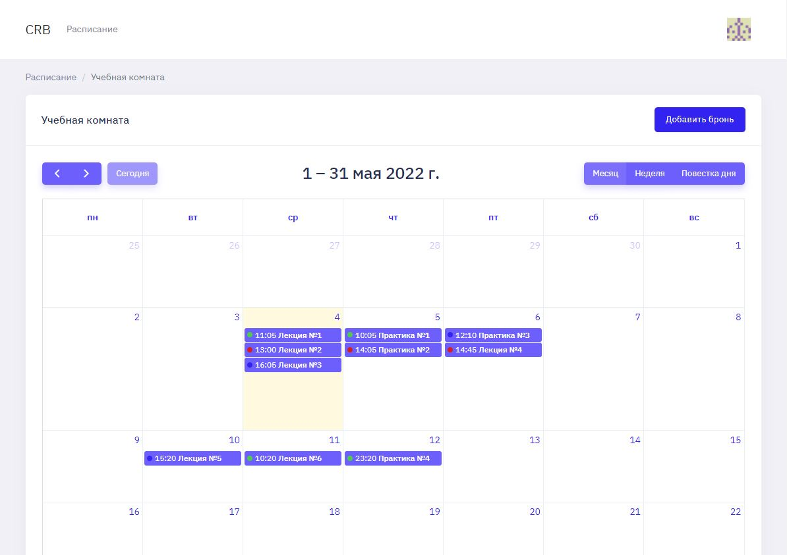

# Conference room booking
Cистема для бронирования отдельных комнат под определенные нужды для группы лиц

## Описание

### Основное
Основная страница для работы - это расписание.

По началу необходимо добавить комнату.

Далее можно добавлять бронь внутри комнаты. Основные поля для брони:

* Время брони
* Комната
* Цвет
* Наименование
* Участники 

Минимальный промежуток для брони - 30 минут.

Внутри одной комнаты время для брони не пересекается.

### Аккаунт

Есть возможность взаимодействия с собственным аккаунтом:
* Просмотр информации об аккаунте
* Изменение информации об аккаунте
* * Аватар
* * Имя
* * Email
* Изменение пароля
* Просмотр мероприятий, которые организую
* Просмотр мероприятий, в которых принимаю участие

По умолчанию генерируется уникальная аватарка для профиля.

## Стек
Основные технологии
* Symfony (5.4)
* PostgreSQL
* Twig
* SCSS

Основные библиотеки
* [bootstrap](https://www.npmjs.com/package/bootstrap)
* [jquery](https://www.npmjs.com/package/jquery)
* [fullcalendar](https://www.npmjs.com/package/fullcalendar)
* [dropify](https://www.npmjs.com/package/dropify)
* [daterangepicker](https://www.npmjs.com/package/daterangepicker)
* [sweetalert 2](https://www.npmjs.com/package/sweetalert2)

## **Установка**

Команды для установки:

1. `composer install`
2. `npm install`
3. Настроить поле `DATABASE_URL` в файле `.env`
4. Выполнить миграцию `php bin/console doctrine:migrations:migrate`
5. `npm run dev`